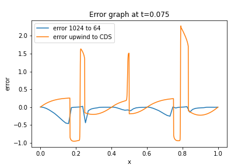
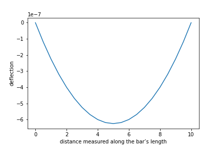

When the functions become complex,analytical differentiaon becomes difficult.Differential equations are solved numerically using different techniques.Comparison study between explicit Euler,Implicit Euler,Range Kutta4 method and verlet integration is conducted.
  

 

 Viscous Burger's Equation with Euler + first order upwind schemes and Euler +second order central difference schemes are solved and compared with each other.The following graph picturizes the error when grid size is 1024 to 64.
   

<figure>
	
	<figcaption>error at t=0.075</figcaption>
</figure>

	Poisson Equation with finite element method is solved to understand the nature of deflection with distance measured along the bar’s length.
	<figure>
	
	<figcaption>u vs x</figcaption>
	</figure>
 

